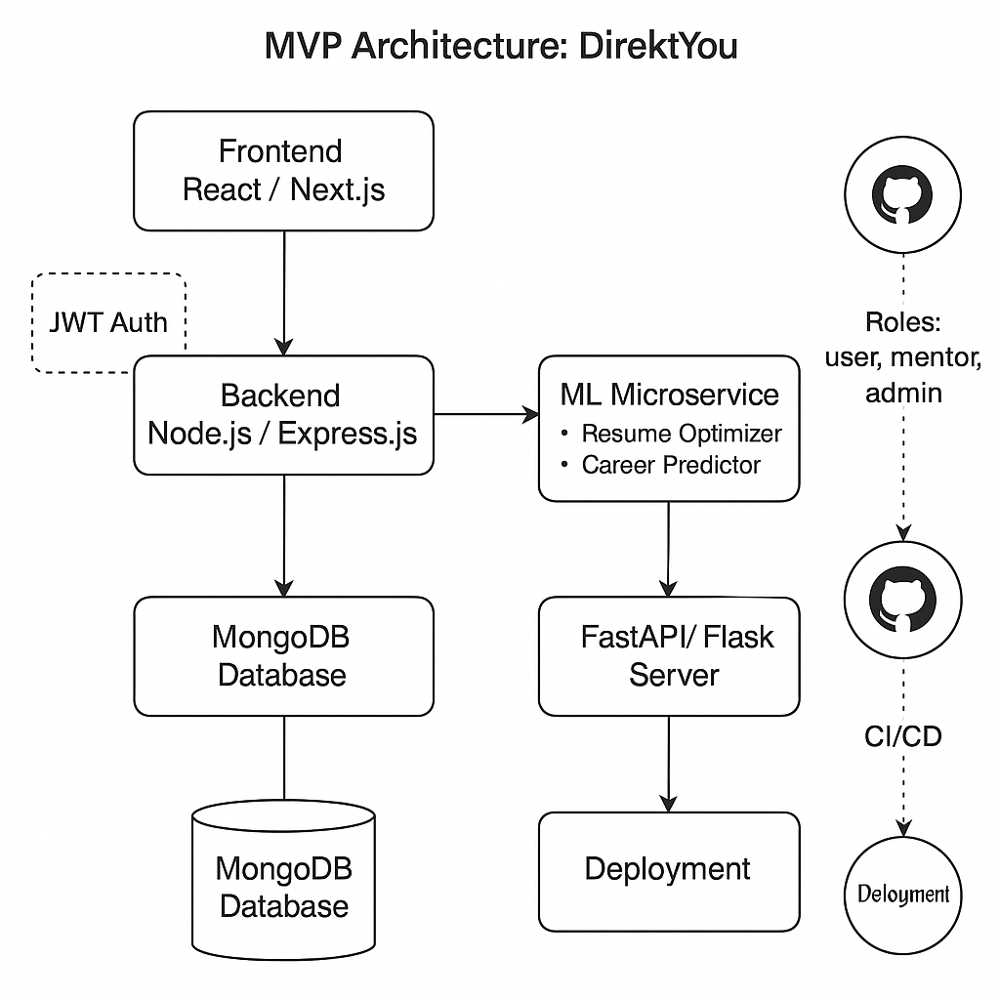

# 🗂️ DirektYou – Documentation & Architecture Hub

This folder contains all visual & technical documentation for the DirektYou platform.

Use this space to help contributors, mentors, and collaborators understand:

- 🧱 System architecture
- 🔄 Data flow & integration
- 🎨 UI/UX design structure
- 🧠 ML pipelines
- ⚙️ DevOps & deployment pipelines

---

## 🧭 Project Overview

**DirektYou** is a full-stack, community-built platform that helps people:

✅ Discover their purpose  
✅ Explore and model career paths  
✅ Connect with mentors, universities, and resources  
✅ Optimize resumes using ML  
✅ Track skill growth and progress

This folder will help everyone understand *how* that system is architected.

---

## 🧱 Folder Structure

/docs ├── README.md → You're here
├── architecture.png → Full system architecture (upload here)
├── frontend-flow.png → UI navigation + user flow
├── backend-api-flow.png → API architecture
├── ml-pipeline.png → ML workflow (data in → model → API)
├── database-schema.png → MongoDB schema diagram
├── deployment-pipeline.png → CI/CD flow (optional)
├── career-journey-map.png → User journey visualization
├── design-preview.jpg → Screenshots or mockups from Figma

markdown
Copy
Edit

---

## 🖼 Suggested Visuals to Include

1. **System Architecture (MVP)**  
   - Frontend ↔ Backend ↔ ML ↔ MongoDB  
   - Discord/Notion integrations (if any)  
   - Auth + Role handling

2. **UI/UX Flowchart**  
   - Landing → Explore → Dashboard → Career Page → Mentor Chat

3. **API Flowchart**  
   - Client requests → Express routes → Controllers → DB/ML → Response

4. **Machine Learning Pipeline**  
   - Resume in → Preprocess → NLP Model → JSON out

5. **Database Schema Diagram**  
   - User, Mentor, Career, Resume models + relationships

6. **Deployment Architecture**  
   - GitHub → CI → Docker → Render / AWS (optional)

7. **Design Snapshots**  
   - Upload .jpg/.png of your latest UI mockups or screenshots

---

## 🛠 Tools to Use

- [Draw.io](https://app.diagrams.net/)  
- [Whimsical](https://whimsical.com/)  
- [Lucidchart](https://lucidchart.com)  
- [Excalidraw](https://excalidraw.com)  
- [Figma](https://figma.com)

---

## 🔗 How to Contribute

If you're working on architecture:

1. Export your diagram as `.png` or `.jpg`  
2. Save it in `/docs` with a meaningful name  
3. Add a short description in this README under a new heading  
4. Open a PR with label `docs`

> Clear systems = faster onboarding = better product 🧠💙

---

## 🧠 Let’s Build with Clarity

This is not just a project — it's a **movement**.  
The clearer the architecture, the easier it is for others to join and contribute.

Welcome to the mind palace of DirektYou.

## 🧱 System Architecture

This diagram represents how DirektYou's core systems interact:  
- Frontend (React/Next.js) connects to Backend (Node.js/Express)  
- Backend interfaces with MongoDB and ML Microservices  
- FastAPI/Flask handles ML model APIs  
- JWT Auth, CI/CD, and Discord ecosystem are also shown
